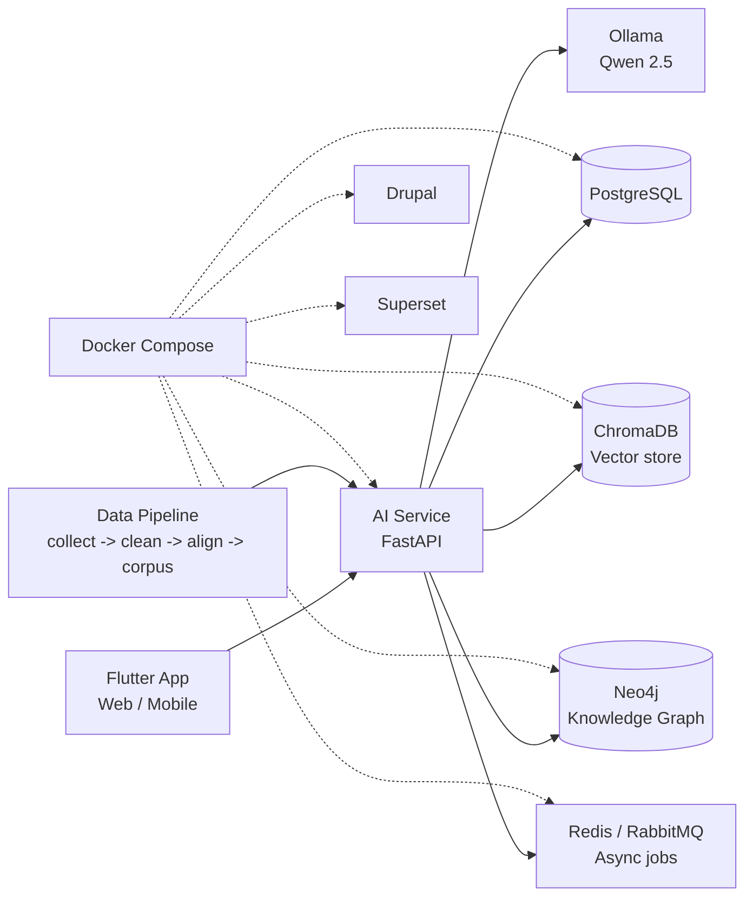

# SCI-Translate

> Hệ thống dịch thuật chuyên sâu tài liệu khoa học Anh - Việt
> Môn: Data Mining | Nhóm: 5 người | Trường ĐHKHTN - ĐHQGHN

---

## Thành viên và phân công

| Thành viên | Vai trò | Phạm vi chính | Branch prefix |
|---|---|---|---|
| TV1 - Trần Duy Anh | Leader / BA Lead | Phân tích nghiệp vụ, tài liệu, điều phối nhóm | `docs/`, `planning/` |
| TV2 - Nguyễn Lê Ngọc Bảo | AI Engineer | AI Service, Ollama, RAG, KG, API dịch thuật | `feature/ai-*` |
| TV3 - Lê Huy Anh Dũng | Flutter Web & Mobile Dev | Flutter frontend, tích hợp API, runtime frontend | `feature/flutter-*`, `feature/web-*`, `feature/mobile-*` |
| TV4 - Phạm Dương Hoàng | Data Engineer | Thu thập, làm sạch, căn chỉnh, seed corpus/KG | `feature/data-*` |
| TV5 - Lê Việt Hoàng | QA/QC | Kế hoạch test, kiểm thử, review chất lượng và xác nhận bàn giao | `test/*`, `qa/*` |

QA/QC do TV5 phụ trách. Các thành viên còn lại tập trung vào module chính của mình và phối hợp sửa lỗi khi TV5 ghi nhận vấn đề.

---

## Kiến trúc hệ thống

Sơ đồ tối giản theo trạng thái hiện tại của repo:



Ghi chú:

- `frontend/flutter_app/` là ứng dụng Flutter chính cho web/mobile.
- `ai_service/` là backend FastAPI, dùng Ollama làm engine dịch, kết hợp RAG, ChromaDB và Neo4j.
- `data_pipeline/` chuẩn bị corpus song ngữ, dữ liệu kiểm thử và seed data cho Knowledge Graph.
- `docker-compose.yml` khởi động hạ tầng runtime gồm PostgreSQL, Neo4j, ChromaDB, Redis, RabbitMQ, AI Service, Drupal và Superset.
- `docs/` chứa contract bàn giao và chiến lược kiểm thử.
- Các thư mục custom cho Drupal/Superset hoặc migration DB chưa có source riêng trong cây thư mục hiện tại; runtime được cấu hình qua Docker Compose.

---

## Chạy nhanh

```bash
# 1. Clone repo
git clone https://github.com/duyanhtr130905/sci-translate.git
cd sci-translate

# 2. Tạo file cấu hình môi trường
cp .env.example .env

# 3. Khởi động hạ tầng Docker
docker compose up -d

# 4. Kiểm tra service
docker compose ps
```

Truy cập nhanh:

- AI API docs: http://localhost:8000/docs
- Drupal: http://localhost:80
- Superset: http://localhost:8088
- Neo4j Browser: http://localhost:7474
- RabbitMQ Management: http://localhost:15672

Ollama chạy trên máy host và được AI Service gọi qua `OLLAMA_BASE_URL`. Trước khi chạy luồng dịch, cần cài Ollama và pull model tương ứng, ví dụ:

```bash
ollama pull qwen2.5:3b
```

---

## Cấu trúc thư mục

```text
sci-translate/
|-- ai_service/
|   |-- api/
|   |-- docs/
|   |-- kg/
|   |-- models/
|   |-- nlp/
|   |-- rag/
|   |-- schemas/
|   |-- scripts/
|   |-- tasks/
|   |-- tests/
|   |-- Dockerfile
|   |-- requirements.txt
|   `-- README.md
|-- data_pipeline/
|   |-- collectors/
|   |-- corpus/
|   |-- etl/
|   |-- kg/
|   |-- scripts/
|   |-- tests/
|   |-- validators/
|   |-- Dockerfile
|   |-- requirements.txt
|   `-- README.md
|-- docs/
|   |-- CONTRACT_AI_TO_WEB.md
|   |-- CONTRACT_DATA_TO_AI.md
|   |-- DOCKER_ACCESS_GUIDE.md
|   |-- HANDOFF_TV2_TO_TV3.md
|   `-- TEST_STRATEGY.md
|-- frontend/
|   |-- flutter_app/
|   |   |-- android/
|   |   |-- ios/
|   |   |-- lib/
|   |   |-- linux/
|   |   |-- macos/
|   |   |-- test/
|   |   |-- web/
|   |   |-- windows/
|   |   |-- pubspec.yaml
|   |   `-- README.md
|   `-- web/
|       `-- README.md
|-- .github/
|   |-- ISSUE_TEMPLATE/
|   `-- workflows/
|-- docker-compose.yml
|-- .env.example
|-- .gitignore
|-- vi_en_dict.json
`-- README.md
```

Các thư mục cache/build/local data như `.pytest_cache/`, `.uv-cache/`, `__pycache__/`, `frontend/flutter_app/build/`, `ai_service/vectorstore/`, `data_pipeline/raw/`, `data_pipeline/cleaned/` và `data_pipeline/aligned/` không nên đưa lên repo.

---

## Luồng bàn giao

1. Data Pipeline -> AI Service: TV4 bàn giao corpus, test set và seed KG theo `docs/CONTRACT_DATA_TO_AI.md`; TV2 kiểm tra trước khi index vào RAG/ChromaDB hoặc dùng cho đánh giá.
2. AI Service -> Frontend: TV2 giữ ổn định API theo `docs/CONTRACT_AI_TO_WEB.md` và `ai_service/docs/openapi.json`; TV3 tích hợp Flutter dựa trên contract.
3. QA/QC: TV5 kiểm thử theo `docs/TEST_STRATEGY.md`, ghi nhận lỗi, xác nhận bàn giao và yêu cầu từng thành viên sửa lỗi trong phạm vi module phụ trách.

---

## Chạy tests

```bash
# Data Pipeline
pytest data_pipeline/tests/ -v

# AI Service
pytest ai_service/tests/ -v

# Flutter
cd frontend/flutter_app
flutter test
```

Một số test cần Docker hoặc Ollama đang chạy. Khi thêm test mới, cập nhật điều kiện môi trường trong `docs/TEST_STRATEGY.md`.

---

## Git workflow

```bash
# Tạo branch mới
git checkout -b feature/ai-rag-pipeline
git checkout -b feature/data-etl
git checkout -b feature/flutter-translate-ui
git checkout -b test/release-checklist
git checkout -b docs/usecase-update

# Commit format
git commit -m "[TV2] feat: add RAG similarity search"
git commit -m "[TV4] fix: handle empty corpus lines"
git commit -m "[TV3] feat: add Flutter bilingual display"
git commit -m "[TV5] test: add QA checklist"
```

Quy tắc merge:

- `main` là nhánh ổn định, chỉ merge qua PR.
- Cần ít nhất 1 người review.
- CI phải pass trước khi merge.
- TV5 xác nhận QA/QC cho các thay đổi ảnh hưởng đến luồng chạy chính hoặc chất lượng bản dịch.

---

## Tài liệu thêm

- [AI Service README](ai_service/README.md)
- [Data Pipeline README](data_pipeline/README.md)
- [Flutter App README](frontend/flutter_app/README.md)
- [Frontend Web README](frontend/web/README.md)
- [Docker Access Guide](docs/DOCKER_ACCESS_GUIDE.md)
- [Test Strategy](docs/TEST_STRATEGY.md)
- [Contract: Data Pipeline -> AI Service](docs/CONTRACT_DATA_TO_AI.md)
- [Contract: AI Service -> Frontend](docs/CONTRACT_AI_TO_WEB.md)
